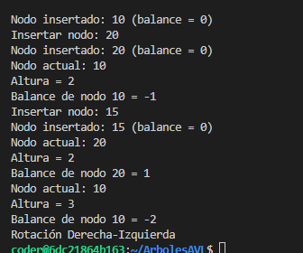

# Estructuras lineales

## 📌 Información General

•⁠  ⁠Título: Arboles AVL

•⁠  ⁠Asignatura: Estructura de Datos

•⁠  ⁠Carrera: Computación

•⁠  ⁠Estudiante: [Kelly Valeria Guaman Leon, Jamileth Estefanía Kumpanam Segarra]

•⁠  ⁠Fecha: [01/07/2025]

•⁠  ⁠Profesor: Ing. Pablo Torres

---

# 🌳 AVL Tree en Java

Este proyecto implementa un **Árbol AVL** en Java, una estructura de datos balanceada que garantiza operaciones eficientes de inserción, eliminación y búsqueda.  
Autores: **Valeria Guaman** y **Jamileth Kumpanam** ❤️

## 📚 ¿Qué es un Árbol AVL?

Un **Árbol AVL** (Adelson-Velsky y Landis) es un árbol binario de búsqueda auto-balanceado. Después de cada operación de inserción o eliminación, el árbol verifica su **factor de equilibrio** y aplica **rotaciones** para mantenerse balanceado.  
Esto asegura una **altura logarítmica**, lo que mejora el rendimiento en comparación con árboles desbalanceados.

## ✅ Funcionalidades del código

- Inserción de nodos en el árbol.
- Cálculo del **factor de balance**.
- Rotaciones:
  - Rotación simple a la derecha (RR)
  - Rotación simple a la izquierda (LL)
  - Rotación doble izquierda-derecha (LR)
  - Rotación doble derecha-izquierda (RL)
- Impresión de mensajes de inserción y rotación en consola para facilitar el seguimiento.

## 🧠 Estructura del proyecto

### 1. `App.java`
Contiene el método `main` donde se crea una instancia del árbol AVL y se insertan algunos nodos.

```java
AVLTree avl = new AVLTree();
avl.insert(10);
avl.insert(20);
avl.insert(15);



https://file+.vscode-resource.vscode-cdn.net/Users/jamilethkumpanam/Desktop/EDD/ArbolesAVL/image.png?version%3D1751412762241